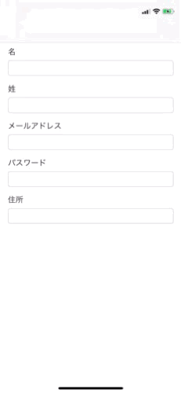

# MovableToolbar



## Install

### Swift Package Manager

```swift
.package(url: "https://github.com/fromkk/MovableToolbar.git", from: "0.0.1"),
```

## Usage

Example code

```swift
import MovableToolbar

lazy var toolbar: MovableToolbar = {
    let toolbar = MovableToolbar(frame: CGRect(origin: .zero, size: CGSize(width: view.bounds.size.width, height: 44)))
    toolbar.toolbarDataSource = self
    toolbar.toolbarDelegate = self
    return toolbar
}()

// MARK: MovableToolbarDataSource

func numberOfRows(in toolbar: MovableToolbar) -> Int {
    return Item.allCases.count
}

func inputView(with toolbar: MovableToolbar, row: Int) -> UIView? {
    return textField(of: Item.allCases[row])
}

// MARK: MovableToolbarDelegate

func currentInputView(with toolbar: MovableToolbar) -> UIView? {
    return Item.allCases.map { textField(of: $0) }.first { textField -> Bool in
        return textField.isFirstResponder
    }
}
```

and set `toolbar` to `textField.inputAccessoryView`

```swift
textField.inputAccessoryView = toolbar
```

